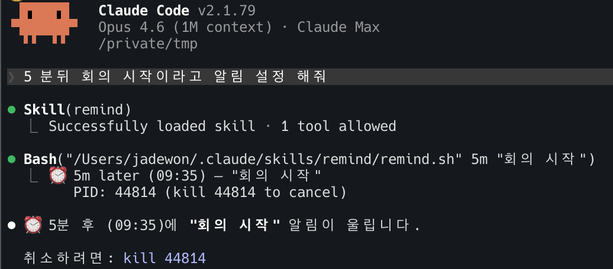

# remind

macOS notification timer skill.

> [한국어](./README.ko.md)

## Usage

```
/remind 5m meeting starts
/remind 17:00 time to leave
/remind 2h30m laundry
```

Also works with natural language:

```
Set a reminder for 5 minutes from now to start the meeting
```

### Time formats

| Format | Example | Description |
|--------|---------|-------------|
| `Ns` | `30s` | N seconds from now |
| `Nm` | `5m` | N minutes from now |
| `Nh` | `2h` | N hours from now |
| `NhNm` | `1h30m` | Compound |
| `HH:MM` | `17:00` | Absolute (24h) |
| `Ham/pm` | `5pm` | Absolute (12h) |

## Example


